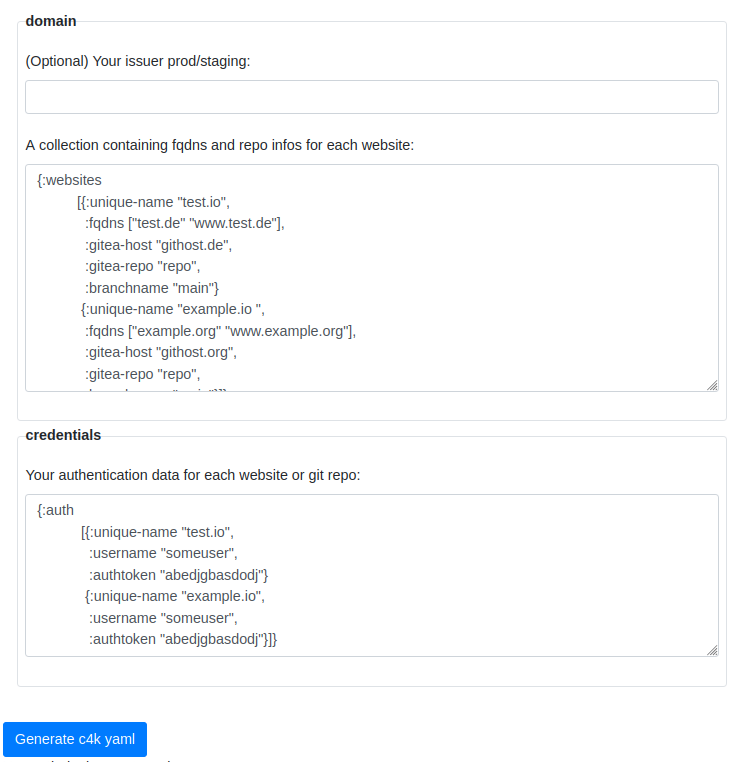

# convention 4 kubernetes: c4k-website

[](https://clojars.org/org.domaindrivenarchitecture/c4k-website) [](https://gitlab.com/domaindrivenarchitecture/c4k-website/-/commits/main) 

[ chat over e-mail](mailto:buero@meissa-gmbh.de?subject=community-chat) | [ meissa@social.meissa-gmbh.de](https://social.meissa-gmbh.de/@meissa) | [Blog](https://domaindrivenarchitecture.org) | [Website](https://meissa.de)

## Purpose

**GitOps for static generated Websites.**

c4k-website generates k8s-manifest for a webserver serving static html.

c4k-website is an example how to create k8s manifests for OneShotDeployments with https://repo.prod.meissa.de/meissa/c4k-common.

## Features

- [convention 4 kubernetes: c4k-website](#convention-4-kubernetes-c4k-website)
  - [Purpose](#purpose)
  - [Features](#features)
    - [Serving multiple websites](#serving-multiple-websites)
    - [https \& Letsencrypt Certificates](#https--letsencrypt-certificates)
    - [Ratelimiting](#ratelimiting)
    - [Monitoring](#monitoring)
    - [GitOps your Websites](#gitops-your-websites)
    - [Support Hugo and Cryogene](#support-hugo-and-cryogene)
  - [Try out](#try-out)
  - [Usage](#usage)
  - [Development \& mirrors](#development--mirrors)
    - [Create a new version of docker image "c4k-website-build"](#create-a-new-version-of-docker-image-c4k-website-build)
  - [License](#license)

### Serving multiple websites

You can serve many websites, each of can listen to a list of domain names. E.g.

```yaml
# Config example
websites:
- unique-name: "test.io" 
  fqdns: ["test.de", "test.org", "www.test.de", "www.test.org"]
- unique-name: "example.io"
  fqdns: ["example.org", "www.example.com"]
```

### https & Letsencrypt Certificates

The domain names listed will get their certificates from letsencrypt out of the box.

### Ratelimiting

There is a Ratelimit included for each website. This makes it harder to DOS one or all websites served.

### Monitoring

Monitoring on GrafanaCloud (or any other grafana) is included out of the box.

### GitOps your Websites

If your repository is on a frogejo or gitea repo, we included GitOps. We ask every ten minutes the repo api for new pushed content.

If there is new content we generate the new static html & serve it.

### Support Hugo and Cryogene

For static html generation we support cryogen & hugo.

## Try out

Click on the image to try out in your browser:

[](https://domaindrivenarchitecture.org/pages/dda-provision/c4k-website/)

Your input will stay in your browser. No server interaction is required.

You will also be able to try out on cli:
```
c4k-website src/test/resources/valid-config.yaml src/test/resources/valid-auth.yaml
```

## Usage

Prerequisites:
* DNS routes pointing to your k8s cluster.
* frogejo or gitea instance for your website repo. In doubt use https://codeberg.org
* A git repository with your hugo / cryogene website
  * the project provides a `generate.sh` (maybe your generatoin needs some preprocessing)
  * `generate.sh` deliver its static generated html to `target/html`


## Development & mirrors

Development happens at: https://repo.prod.meissa.de/meissa/c4k-website

Mirrors are:

* https://codeberg.org/meissa/c4k-website.git
* https://gitlab.com/domaindrivenarchitecture/c4k-website (issues and PR, CI)
* https://github.com/DomainDrivenArchitecture/c4k-website

For more details about our repository model see: https://repo.prod.meissa.de/meissa/federate-your-repos

### Create a new version of docker image "c4k-website-build"

Go to folder `infrastructure/build/` and create an image with `pyb image`. 
After you have tagged the image and pushed it to "docker.io" it can be used by c4k-website. (TODO: document how to tag and push.)  
To use the new image, update the image's version in line  
`- image: domaindrivenarchitecture/c4k-website-build:2.0.6`   
in file: [build-cron.yaml](src/main/resources/website/build-cron.yaml)  
Then (re-)deploy the c4k-website to the server or - alternatively - update the version of the image manually on the server 
in the corresponding cronJob-Deployment to automatically pull and use the new image on the server. 

## License

Copyright © 2022 - 2025 meissa GmbH
Licensed under the [Apache License, Version 2.0](LICENSE) (the "License")
Pls. find licenses of our subcomponents [here](doc/SUBCOMPONENT_LICENSE)

[provs]: https://gitlab.com/domaindrivenarchitecture/provs/
