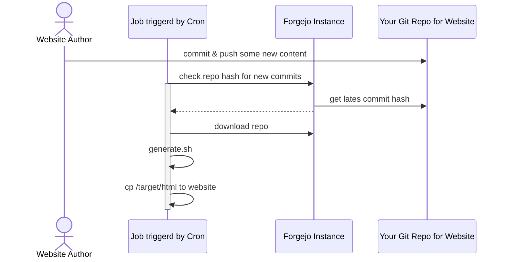

# GitOps for Websites

```mermaid
sequenceDiagram
    Actor a as Website Author
    participant j as Job triggerd by Cron
    participant f as Forgejo Instance
    participant g as Your Git Repo for Website

    a ->> g: commit & push some new content
    j ->> f: check repo hash for new commits
    activate j
    f ->> g: get lates commit hash
    f -->> j: 
    j ->> f: download repo
    j ->> j: generate.sh
    j ->> j: cp /target/html to website
    deactivate j

```
