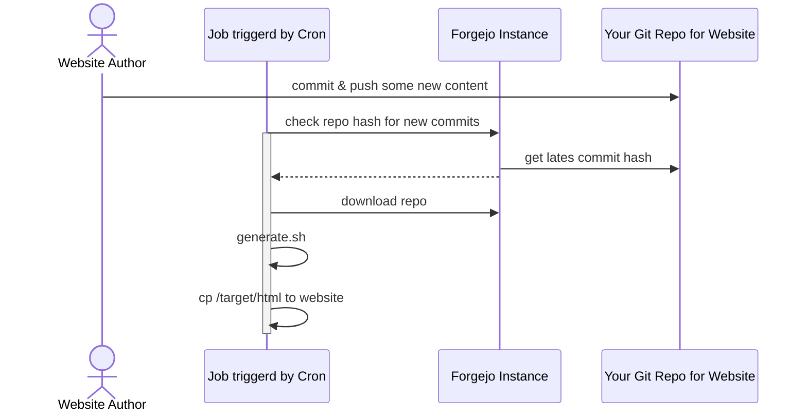
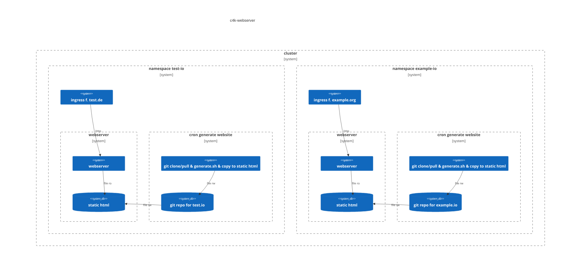

# GitOps for Websites



# Runtime view

For the example configuration 

```yaml
issuer: "staging"
websiteconfigs:
- unique-name: "test.io" 
  fqdns: ["test.de", "test.org", "www.test.de", "www.test.org"]
  forgejo-host: "codeberg.org"
  repo-name: "repo"
  branchname: "main"
- unique-name: "example.io"
  fqdns: ["example.org", "www.example.com"]
  forgejo-host: "fineForgejoHost.net"
  repo-name: "repo"
  branchname: "main"
mon-cfg: 
  grafana-cloud-url: "url-for-your-prom-remote-write-endpoint"
  cluster-name: "website"
  cluster-stage: "test"
```

the website runtime looks like:


