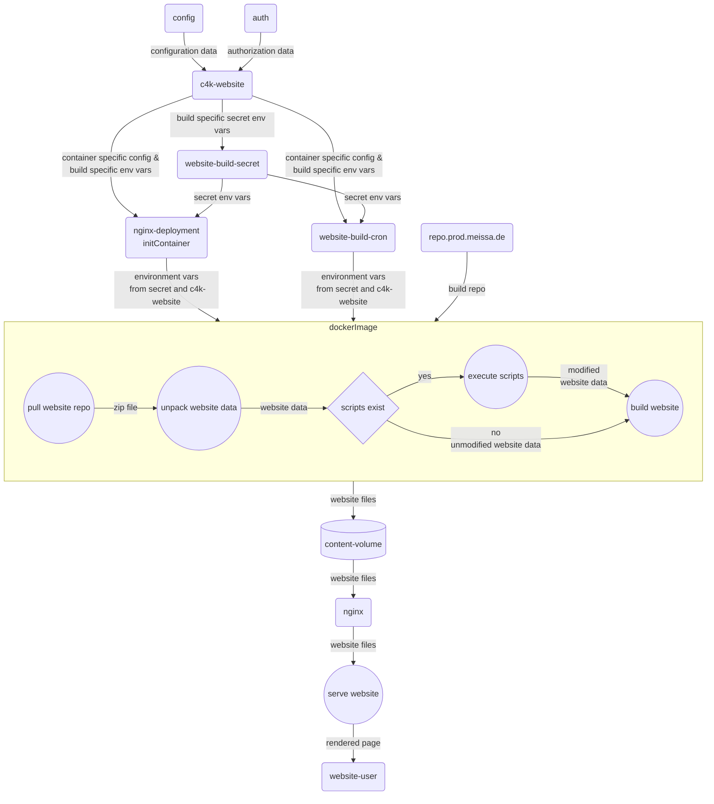

# Data Flow from config & auth to final website

```mermaid
flowchart TB
    conf(config)
    auth(auth)
    c4k(c4k-website)
    sec(website-build-secret)
    depl(nginx-deployment\ninitContainer)
    cron(website-build-cron)
    repo(repo.prod.meissa.de)
    vol[(content-volume)]
    nginx(nginx)
    serve((serve website))
    user(website-user)
    subgraph dockerImage
        build((build website))
        pull((pull website repo))
        unpack((unpack website data))
        exec((execute scripts))
        if0{scripts exist}
        pull -- zip file --> unpack
        unpack -- website data --> if0        
        if0 -- yes --> exec
        exec -- modified\n website data--> build
        if0 -- no\n unmodified website data --> build
    end
    conf -- configuration data --> c4k
    auth -- authorization data --> c4k
    c4k -- container specific config &\n build specific env vars--> depl & cron
    c4k -- build specific secret env vars --> sec
    sec -- secret env vars --> depl & cron
    depl & cron -- environment vars\n from secret and c4k-website --> dockerImage
    repo -- build repo --> dockerImage
    dockerImage -- website files --> vol
    vol -- website files --> nginx
    nginx -- website files --> serve
    serve -- rendered page --> user
```
