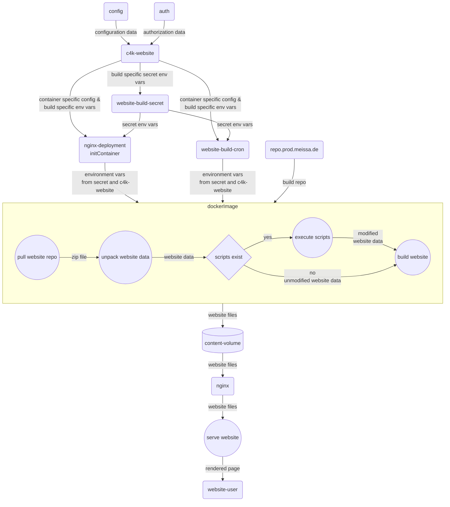

# Data Flow from confif & auth to final website

```mermaid
flowchart TB
    a0(config)
    a1(auth)
    c4k(c4k-website)
    sec(website-build-secret)
    b(nginx-deployment\ninitContainer)
    c(website-build-cron)
    d(repo.prod.meissa.de)
    e[(content-volume)]
    f(nginx)
    g((serve website))
    h(website-user)
    subgraph dockerImage
        j((build website))
        i((pull website repo))
        unpack((unpack website data))
        exec((execute scripts))
        if0{scripts exist}
        i -- zip file --> unpack
        unpack -- website data --> if0        
        if0 -- yes --> exec
        exec -- modified\n website data--> j
        if0 -- no\n unmodified website data --> j
    end
    a0 -- configuration data --> c4k
    a1 -- authorization data --> c4k
    c4k -- container specific config &\n build specific env vars--> b & c
    c4k -- build specific secret env vars --> sec
    sec -- secret env vars --> b & c
    b & c -- environment vars\n from secret and c4k-website --> dockerImage
    d -- build repo --> dockerImage
    dockerImage -- website files --> e
    e -- website files --> f
    f -- website files --> g
    g -- rendered page --> h
```
